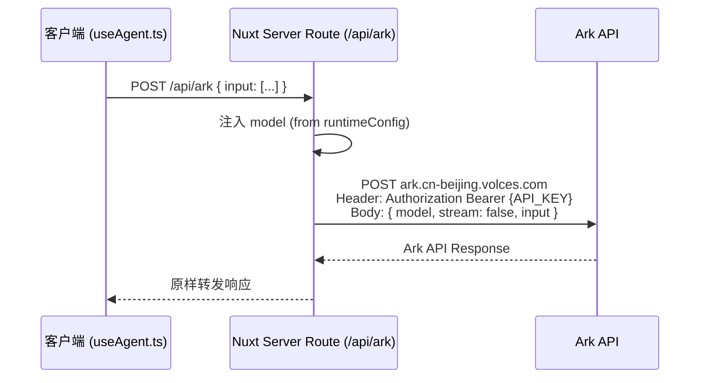

## 产品概述

将项目中残留的 Netlify 部署痕迹全部清除，并用 Nuxt 自带的 Server Routes (`server/api/`) 替代原有的 Netlify Serverless Function，实现 Ark API 代理中转，确保 API 密钥不会暴露到客户端。

## 核心功能

- 删除所有 Netlify 相关配置文件和代码引用（netlify.toml、nuxt.config.ts 中的 Netlify 配置、useAgent.ts 中的环境分支判断、.env 中的 Netlify 注释）
- 创建 Nuxt Server Route (`server/api/ark.post.ts`) 作为 Ark API 代理中转
- 简化 `useAgent.ts`：移除 dev/prod 双路径逻辑，统一走 `/api/ark` 代理
- API 密钥仅在服务端注入，客户端不再持有密钥

## 技术栈

- 框架：Nuxt 4 (已有)，使用其内置的 `server/api/` 服务端路由
- API 代理：Nuxt Server Routes + `$fetch` 转发请求到火山方舟 Ark API
- 环境变量：服务端通过 `useRuntimeConfig()` 读取 `ARK_API_KEY` 和 `ARK_MODEL_ID`

## 实现方案

### 整体策略

用 Nuxt Server Routes 完全替代 Netlify Serverless Function。Nuxt 的 `server/api/` 目录中的文件会自动注册为 API 端点，与 Next.js API Routes 功能等价。由于 Nuxt dev server 同样支持 server routes，开发和生产环境行为一致，不再需要 dev/prod 双路径。

### 关键技术决策

1. **统一请求路径**：`useAgent.ts` 始终向 `/api/ark` 发请求，移除所有 dev/prod 环境判断分支
2. **密钥完全服务端化**：`.env` 中删除 `NUXT_PUBLIC_*` 前缀的公开变量，仅保留服务端变量 `RESUME_ARK_API_KEY` 和 `RESUME_ARK_MODEL_ID`，通过 `runtimeConfig` 服务端字段注入
3. **Server Route 职责**：接收客户端的 `input` 数组，在服务端注入 `model` 和 `Authorization`，转发到 Ark API，原样返回响应
4. **简历描述保留**：`app/constants/resume.ts` 中提及 Netlify 是项目经验描述，不属于"部署痕迹"，不修改

### 数据流



## 实现细节

### 1. 删除 Netlify 痕迹

- **删除** `netlify.toml` 文件（仅包含 `[functions] directory = "netlify/functions"`）
- **修改** `nuxt.config.ts`：移除 `isNetlifyDev` 公开配置，更新服务端环境变量注释
- **修改** `useAgent.ts`：移除 `isNetlifyDev`/`isDev` 环境判断，移除 dev 模式直接调用 API 的分支，统一使用 `/api/ark`
- **修改** `.env`：移除 `NUXT_PUBLIC_RESUME_ARK_API_KEY` 和 `NUXT_PUBLIC_RESUME_ARK_MODEL_ID`（不再需要客户端暴露），移除 Netlify 相关注释

### 2. 创建 Nuxt Server Route

- **新建** `server/api/ark.post.ts`：
- 使用 `defineEventHandler` + `readBody` 接收客户端请求
- 通过 `useRuntimeConfig()` 获取 `arkApiKey` 和 `arkModelId`
- 向 Ark API 发起代理请求，注入 `model` 和 `Authorization` header
- 返回 Ark API 的原始响应（或错误信息）

### 3. 更新 useAgent.ts 调用逻辑

- `callArk()` 始终使用 `/api/ark`，请求体仅包含 `stream: false` 和 `input`
- 移除所有 `Authorization` header 的客户端注入
- 移除 `model` 字段的客户端注入
- 移除 `apiKey` 的返回值（客户端不再持有密钥）

### 注意事项

- `.env` 文件中 API Key 属于敏感信息，确保 `.gitignore` 已包含 `.env`（Nuxt 默认已忽略）
- Server Route 中的错误处理需要捕获 Ark API 的网络错误和业务错误，返回统一格式的错误响应
- Nuxt 4 中 `server/` 目录位于项目根目录（与 `app/` 同级），不在 `app/` 内部

## 目录结构

```
web-resume/
├── netlify.toml                          # [DELETE] Netlify 函数配置
├── nuxt.config.ts                        # [MODIFY] 移除 isNetlifyDev，更新注释
├── .env                                  # [MODIFY] 移除 NUXT_PUBLIC_* 变量和 Netlify 注释
├── app/
│   └── composables/
│       └── useAgent.ts                   # [MODIFY] 移除环境分支，统一走 /api/ark
├── server/
│   └── api/
│       └── ark.post.ts                   # [NEW] Ark API 代理中转服务端路由
```